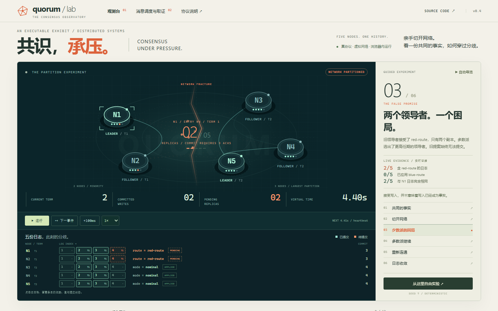
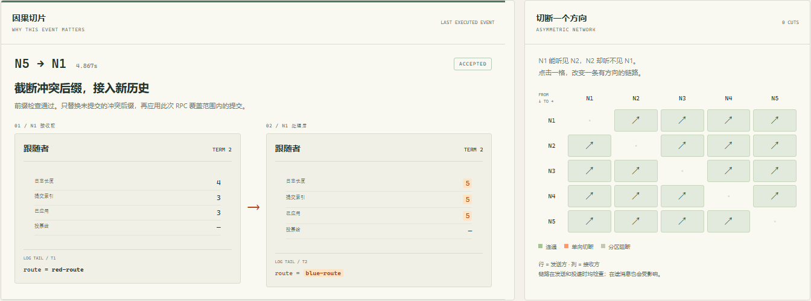
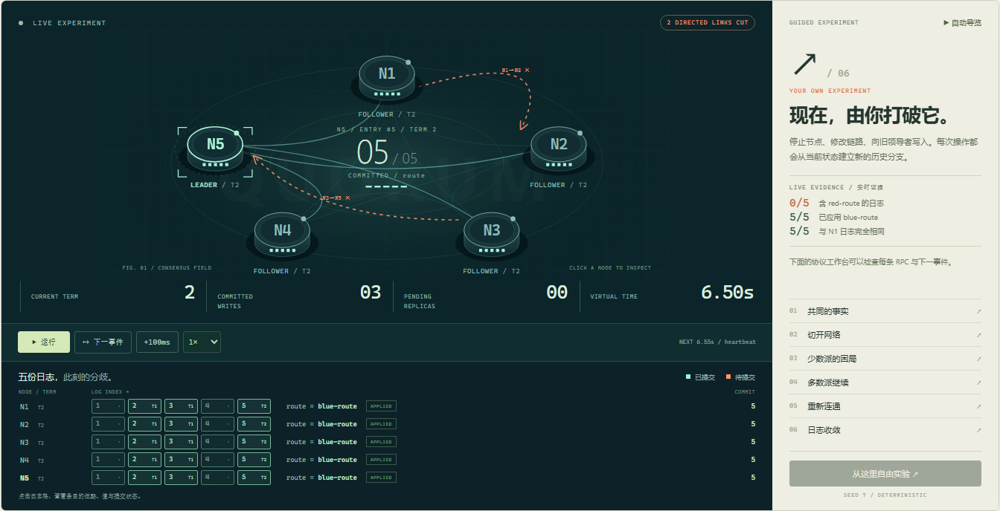
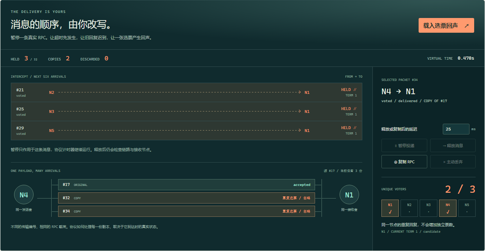

<div align="center">

# Quorum Lab

### CONSENSUS, UNDER PRESSURE.

**共识，承压。**

An executable exhibit of distributed consensus.

**[进入共识观测台 →](https://qiyuhuating.github.io/quorum-lab/)** · [v0.4.0 发布目标](https://github.com/qiyuhuating/quorum-lab/releases/tag/v0.4.0)

[](https://github.com/qiyuhuating/quorum-lab/actions/workflows/verify-and-deploy.yml)

TypeScript · React · Web Worker · Independent Raft Engine


</div>

五个节点各自维护任期、投票和日志。网络断成两个小岛之后，两个领导者会同时存在，但只有一侧能把新提案变成已提交的事实。Quorum Lab 把这个过程做成可操作、可检查、可精确复现的作品。

项目与 `yihe-health` 完全独立，拥有独立领域、源码、构建和部署。这里的领导者、写入与日志修复来自独立实现的协议，不由界面直接指定或同步。

## 先看一个完整实验

打开页面，点击 **自动导览**，或逐个选择六个章节：

| 章节            | 真实发生的变化                   | 可检查的证据                                  |
| --------------- | -------------------------------- | --------------------------------------------- |
| 01 共同的事实   | 完成选举与两个初始写入           | 五份日志与状态机一致                          |
| 02 切开网络     | 旧领导者被留在 2/5 少数派        | 链路断开，节点认知暂未改变                    |
| 03 少数派的困局 | 接受 `red-route`；多数派重新选举 | 两个副本、零新增提交、不同任期的两个领导者    |
| 04 多数派继续   | 多数派提交 `blue-route`          | 三个节点应用新值，少数派保留待提交后缀        |
| 05 重新连通     | 恢复链路，暂不推进时钟           | 抓住日志修复发生之前的瞬间                    |
| 06 日志收敛     | 旧领导者退位，冲突后缀被覆盖     | `red-route` 消失；五个状态机应用 `blue-route` |

导览是种子 **7** 的同一个操作历史中的六个检查点。每个检查点在 Worker 中执行真实协议回放。右侧证据和中心副本数由当前快照计算。控制节点、写入或推进时间后，进入自由实验并从此处分支。



## 从观测进入调试

- **逐事件推进**：执行下一条有效消息或定时器，跳过已经失效的定时器；查看即将发生的事件及顺序。
- **RPC 取证**：检查实际 RequestVote / AppendEntries 请求与回复的完整载荷、任期、前缀索引、提交索引、投递状态与丢包原因。
- **因果切片**：读取消息实际执行的接受、拒绝、忽略或丢弃分支；对比接收端处理前后的角色、任期、投票、提交位置和日志末条。筛选冲突修复，检查对应 RPC 的历史切片。
- **日志与节点透视**：对比五份日志，查看最新提案值、待提交状态、投票、commit/applied index、状态机与领导者复制进度。
- **非对称故障**：在 5×5 链路矩阵中单独切断 N1→N2，反向通信独立；结合分区、节点崩溃、延迟与丢包。发送和投递都会检查连接，在途消息也受影响。
- **回到过去**：操作滑块重建任意历史前缀，固定当前快照作为对照，改变下一步，再比较节点内部状态与提交数量。
- **完整复现**：导出种子与操作序列，导入后恢复相同完整快照。历史原始未来保留到一次新的分支操作发生。





想观察“拒绝追加 → 领导者回退 → 节点追上”的路径，可导入 [落后节点恢复实验](docs/experiments/lagging-node.json)，逐事件推进；[非对称故障实验](docs/experiments/asymmetric.json) 可直接重放单向链路故障。解释数据来自执行分支，不根据当前画面推测历史。

## 改写消息顺序：选票会产生回声，选民不会

在消息调度台点击 **载入选票回声**。四个节点已经实际投票，回复被暂停。一份回复与它的两份完整载荷副本到达候选者：三次到达，只贡献一个独立选民。候选者停在 **2 / 3**，两份副本的真实处理分支是 `duplicate-vote`。

选择另一节点的暂停选票，将延迟设为 **1ms**，点击释放，再逐事件推进。独立票数达到 **3 / 3**，候选者才成为领导者。谱系图、前后状态和每条 RPC 都来自协议执行记录。



可以暂停、释放、主动丢弃在途消息，或复制保留窗口内的完整 RPC。释放/复制延迟为 1–5,000ms，最多暂停 32 条消息；暂停期间选举计时器继续运行。旧消息的排期被显式失效，重新释放到原定时刻也只执行一次。链路与离线状态仍在投递时检查。

[选票回声回放](docs/experiments/vote-echo.json) · [旧确认迟到回放](docs/experiments/stale-ack.json) · [设计与验收](docs/transport-design.md)。第二个实验让旧 AppendResponse 晚于更新的确认到达，实际产生 `stale-rpc`，复制进度保持不变。用 `npm run fixtures` 可从公开引擎操作重新生成两份素材。

## 工程设计

| 设计                               | 解决的问题                                                 |
| ---------------------------------- | ---------------------------------------------------------- |
| 五个独立 Raft 状态机 + RPC         | UI 不参与协议决策；选举与复制通过消息完成                  |
| 稳定最小堆 + Mulberry32 + 虚拟时钟 | 延迟、乱序、丢包与故障可以精确重放                         |
| 当前任期提交规则 + 新领导者 no-op  | 安全提交当前与继承的日志条目                               |
| AppendEntries 请求序号与覆盖索引   | 忽略过期响应；防止乱序反馈回退复制进度                     |
| 模拟稳定存储与易失状态分离         | 崩溃保留任期/投票/日志，恢复后通过协议重建应用状态         |
| Worker 中的检查点重建              | 导览、历史回放与协议运算离开界面线程                       |
| 历史安全观察器                     | 监测选举唯一性、领导者完整性、日志匹配、应用安全与提交前缀 |
| 有界消息取证与输入验证             | 保留最近 128 条真实 RPC；拒绝无效、超大或超长实验          |
| 分支解释 + 接收端前后切片          | 区分前缀拒绝、实际截断、过期确认与提交推进                 |
| 有方向的链路与两次连通检查         | 复现非对称故障，区分发送时和在途期间的消息丢弃             |
| 可失效的消息排期 + 暂停保留区      | 旧排期不会重复执行；长期暂停不会丢失可释放的真实载荷       |
| 完整 RPC 副本 + 消息谱系           | 独立传输编号保留相同协议载荷，验证去重与过期确认分支       |
| 三浏览器生产验收 + Pages 发布门禁  | 验证真实构建、Worker、仓库子路径、移动端与减少动画模式     |

[架构与协议细节](docs/architecture.md) · [设计反思与验收目标](docs/redesign.md) · [验收结果](docs/validation.md) · [路线图](docs/roadmap.md)

## 本地运行

Node.js **22.12+**，CI 使用 Node 24。

```sh
npm ci
npm run dev
```

生产版本：

```sh
npm run build
npm run demo
```

打开 `http://127.0.0.1:4173/quorum-lab/`。初始状态已经通过协议提交两个示例写入，并暂停等待操作。Worker 需要 HTTP 环境。Release 提供无需安装 npm 依赖的便携演示包，仍需 Node.js。

## 验证与边界

```sh
npm run check
npx playwright install --with-deps chromium firefox webkit
npm run test:e2e
npm run benchmark
```

**33 个协议测试、66 个生产浏览器测试（每浏览器 22 个）**；另有 100 组混合故障实验，包含分区、单向断链、崩溃、丢包及消息调度，执行 **463,370** 次状态检查，发送 **365,633** 条模拟消息，全部完整快照精确回放，未检测到安全违规。最终收敛还检查五节点在线、日志和状态机一致、commit/applied index 一致，以及暂停消息已清空。其中暂停/释放各 **800** 次，复制 **800** 次，主动丢弃 **898** 次。CI 关闭自动重试，并额外各重复 12 次 WebKit 单向链路、暂停消息导出/恢复及实时控件布局检查。

独立复审发现两处 UI 上下文回归：切换原始消息/副本时谱系仍可能展示另一消息族；并存领导者时选票证明可能展示另一接收者。旧 UI 的两项复现 **2/2 失败**，修复后三浏览器 **6/6 通过**，没有重试。便携验收使用自己启动的解压服务，通过 IPC ready 获取动态端口；四项实际进程检查确认服务身份、启动失败、运行中早退与占用端口行为。最终整套本地 **66/66 通过**，50.5 秒，零重试；最终构建的本地 HTTP 演示与独立解压便携包也通过完整浏览器验收。v0.4 云端发布仍待门禁执行，状态见 [validation.md](docs/validation.md)。这些是测试证据，不能作为形式化证明或真实分布式集群吞吐数据。

实现固定五节点、对称分区与单向链路故障、基本 Raft、模拟稳定存储与字符串状态机。真实磁盘 IO、快照压缩、成员变更、真实客户端发现、恰好一次语义和线性一致读尚未实现。自动写入目标为实验者的全局观察便利，不模拟真实客户端发现。

## 展示材料

[90 秒面试演示](docs/demo-script.md) · [实际界面录屏](docs/media/demo.webm) · [移动端](docs/media/mobile.png) · [项目选题审查](docs/github-audit.md) · [发布流程](docs/publish.md)

```text
src/engine/    协议、事件队列、六幕实验、回放与 Worker
src/ui/        空间网络、日志矩阵、取证与操作界面
tests/         协议、故障、安全与检查点证据
e2e/           Chromium / Firefox / WebKit 生产交互验收
scripts/       静态服务器、基准、真实演示采集
docs/          架构、验收、演示素材与路线图
.github/       CI、Pages 与带校验的自动版本发布
```

[MIT](LICENSE) © 2026 qiyuhuating
