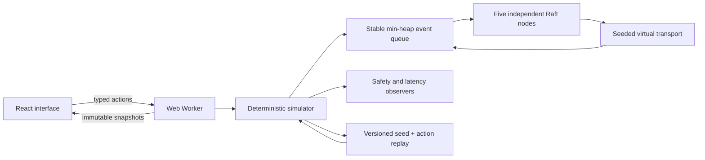

# Architecture and protocol decisions

Quorum Lab is an executable model of fixed-membership Raft. Its protocol runs independently from React and from wall time. Five nodes exchange actual simulated RequestVote and AppendEntries messages; the UI does not assign a leader or synchronize logs directly.

## Protocol state

| Lifetime                 | State                                                                | Crash behavior                                                  |
| ------------------------ | -------------------------------------------------------------------- | --------------------------------------------------------------- |
| Simulated stable storage | `term`, `votedFor`, `log`                                            | Retained across crash/recovery                                  |
| Volatile node state      | role, election timer, votes, commit/applied index, application state | Reset; rebuilt through log synchronization                      |
| Leader volatile state    | per-follower `nextIndex`, `matchIndex`, response sequence            | Reinitialized on leadership                                     |
| Experiment observer      | canonical committed history, elected leaders, proposal latency       | Retained for safety detection; never used by protocol decisions |

Stable storage is an in-memory model of the Raft durability assumption. It performs no filesystem write or fsync. Exported experiments reconstruct the entire model instead of persisting a live database.

## Elections

Nodes use randomized 450–799 ms election timeouts and a fixed 100 ms heartbeat interval. Candidates increment their term, persist their self-vote and request votes. A follower grants at most one vote per term and compares candidate logs by **last term first, then last index**. Any higher-term RPC moves a node to follower state.

A disconnected former leader may remain a leader in its own term. The UI can therefore show multiple leaders in different terms. A leader is elected only after three distinct votes. There is no pre-vote or check-quorum extension.

## Replication and commit

AppendEntries validates the previous index and term before accepting entries. Followers truncate only conflicting suffixes. Leaders backtrack `nextIndex` on rejection. Append responses carry the request sequence and covered index; stale responses cannot move replication progress backwards.

A leader advances its commit index only when at least three replicas contain an entry **from its current term**. Each new leader appends a no-op, which lets it safely commit inherited entries. A follower updates its commit index only through the prefix covered by that AppendEntries RPC. This avoids applying an unrelated suffix after an older heartbeat.

The state machine is a small deterministic string map. A proposal acknowledgement means the leader accepted a write into its log. Only `committed` metrics, commit-index cells and the node state machine demonstrate commitment. Accepted proposals can be overwritten following a partition.

The UI's automatic target uses the highest-term leader visible to the simulator. This is a convenience for an experimenter with global observation; it does not model real client leader discovery, linearizable reads or exactly-once request deduplication. An explicit node target lets users test a stale leader.

## Scheduler and fault model

- A binary min-heap orders events by `(virtual time, insertion sequence)`.
- Mulberry32, seeded by an unsigned 32-bit integer, generates election times, message jitter and packet loss.
- Message delay is the configured base ±50%. Messages can be reordered.
- Partition groups disable links across groups in both directions. Delivery checks connectivity again, so packets already in flight can be dropped by a newly created partition.
- Crash drops messages to an offline receiver. A packet already sent by a crashed node can still arrive, as with a message already on a wire.
- Epoch counters invalidate stale timers after role changes and recovery.

There is no `Date`, `Math.random`, real network access or wall-time input in the engine. React sends advance actions; changing display speed changes how quickly virtual time is requested, never the protocol timing rules.

## Runtime safety observers

The engine checks after every processed event and every external action. Violations are retained and stop the worker's current request with an error.

| Invariant                   | Evidence inspected                                                                              |
| --------------------------- | ----------------------------------------------------------------------------------------------- |
| Election safety             | Historical elected leader by term                                                               |
| Leader completeness         | Every newly elected leader contains the observer's committed prefix                             |
| Log matching                | Equal index/term implies equal entries and every preceding entry                                |
| State machine safety        | Every applied entry agrees with the observer's canonical entry at that index                    |
| Committed prefix protection | Conflict truncation never reaches a node's committed prefix; applied/commit bounds remain valid |

Passing sampled simulations is evidence of tested behavior, not a formal proof. The observer maps are instrumentation and do not provide a consensus shortcut.

## Replay and boundaries

The version 1 format contains a seed and a normalized action list. Import validates every action before replay: five valid node IDs, complete partition coverage, bounded network settings, key/value lengths, operation count and cumulative time. Invalid imports leave the current experiment intact.

Rewind rebuilds from the seed through an operation prefix inside the worker. The original future remains available until a new action intentionally branches from that prefix. Export from a rewound position retains the original experiment; after branching it exports the new branch.

Experiment limits: 120 seconds of virtual time, 6,000 actions, 2 MB import, 400 recent trace events and 128 recent packets. Client proposals are refused when the target log reaches 256 entries; protocol no-ops can extend that threshold. These limits keep browser work bounded. Full action history, rather than the visible trace ring, drives replay.

Fixed five-member clusters, symmetric partitions, crash/recovery and basic Raft are implemented. Membership changes, snapshot compaction, asymmetric links, packet duplication, real storage, client sessions and linearizable reads are roadmap items.

## Primary source

[Ongaro and Ousterhout, In Search of an Understandable Consensus Algorithm, extended version](https://raft.github.io/raft.pdf): Figure 2 and §§5.2–5.4, including the current-term commit rule in §5.4.2. The project independently implements the algorithm; it does not reuse another visualization's source.

## Observatory and protocol forensics (v0.2)

`buildPartitionStory()` constructs the six-chapter experiment through normal Simulator actions. It records action cursors, seed and history. The Worker replays the selected prefix while retaining the original future. It never directly sets roles, terms, logs or application state. Seed 7 provides the tested narrated schedule; free experiments accept other seeds.

The center shows actual copies of the selected node's final entry, matched by entry identity at the same index. Copies and leader acknowledgements are distinct: observing three copies is not itself a commit operation. Log styling uses each node's local commit index. Evidence counts red-route holders, blue-route applied maps and complete log agreement with N1. Moving nodes into partition islands changes only rendering; connectivity is enforced in the transport.

Packets retain a cloned actual RPC payload, status and send/delivery drop cause. Snapshot copies isolate observation from protocol state. Delivered packets remain inspectable in the last-128 ring. Only real recent packets are drawn on the topology; decorative orbits generate no traffic.

The queue exposes twelve still-active scheduled events sorted by `(at, seq)`. `step` processes one such event, consuming invalidated timers that precede it. Messages that will be dropped at delivery remain active events. Step actions extend the version-1 action union: v0.2 accepts v0.1 files, while v0.1 cannot interpret new step actions. Imports prevalidate advance durations and rebuild in a temporary simulator; runtime bounds also enforce elapsed time reached through steps before replacing the active experiment.

Pinned baselines are copied observation snapshots. Comparison reports changed node internals and committed-write delta; it is not a linearizability certificate or causal proof. Rewind retains source history until a new action branches.
