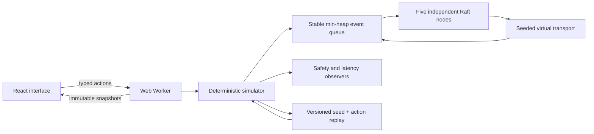

# Architecture and protocol decisions

Quorum Lab is an executable model of fixed-membership Raft. Its protocol runs independently from React and from wall time. Five nodes exchange actual simulated RequestVote and AppendEntries messages; the UI does not assign a leader or synchronize logs directly.

## Protocol state

| Lifetime                 | State                                                                | Crash behavior                                                  |
| ------------------------ | -------------------------------------------------------------------- | --------------------------------------------------------------- |
| Simulated stable storage | `term`, `votedFor`, `log`                                            | Retained across crash/recovery                                  |
| Volatile node state      | role, election timer, votes, commit/applied index, application state | Reset; rebuilt through log synchronization                      |
| Leader volatile state    | per-follower `nextIndex`, `matchIndex`, response sequence            | Reinitialized on leadership                                     |
| Experiment observer      | canonical committed history, elected leaders, proposal latency       | Retained for safety detection; never used by protocol decisions |

Stable storage is an in-memory model of the Raft durability assumption. It performs no filesystem write or fsync. Exported experiments reconstruct the entire model instead of persisting a live database.

## Elections

Nodes use randomized 450–799 ms election timeouts and a fixed 100 ms heartbeat interval. Candidates increment their term, persist their self-vote and request votes. A follower grants at most one vote per term and compares candidate logs by **last term first, then last index**. Any higher-term RPC moves a node to follower state.

A disconnected former leader may remain a leader in its own term. The UI can therefore show multiple leaders in different terms. A leader is elected only after three distinct votes. There is no pre-vote or check-quorum extension.

## Replication and commit

AppendEntries validates the previous index and term before accepting entries. Followers truncate only conflicting suffixes. Leaders backtrack `nextIndex` on rejection. Append responses carry the request sequence and covered index; stale responses cannot move replication progress backwards.

A leader advances its commit index only when at least three replicas contain an entry **from its current term**. Each new leader appends a no-op, which lets it safely commit inherited entries. A follower updates its commit index only through the prefix covered by that AppendEntries RPC. This avoids applying an unrelated suffix after an older heartbeat.

The state machine is a small deterministic string map. A proposal acknowledgement means the leader accepted a write into its log. Only `committed` metrics, commit-index cells and the node state machine demonstrate commitment. Accepted proposals can be overwritten following a partition.

The UI's automatic target uses the highest-term leader visible to the simulator. This is a convenience for an experimenter with global observation; it does not model real client leader discovery, linearizable reads or exactly-once request deduplication. An explicit node target lets users test a stale leader.

## Scheduler and fault model

- A binary min-heap orders events by `(virtual time, insertion sequence)`.
- Mulberry32, seeded by an unsigned 32-bit integer, generates election times, message jitter and packet loss.
- Message delay is the configured base ±50%. Messages can be reordered.
- Partition groups disable links across groups in both directions. Delivery checks connectivity again, so packets already in flight can be dropped by a newly created partition.
- Directed cuts independently disable one sender-to-receiver edge. Connectivity requires both shared partition membership and an enabled directed link. Partition operations preserve cuts; `heal` clears both. Send-time and delivery-time cut reasons are distinct.
- Crash drops messages to an offline receiver. A packet already sent by a crashed node can still arrive, as with a message already on a wire.
- Epoch counters invalidate stale timers after role changes and recovery.

There is no `Date`, `Math.random`, real network access or wall-time input in the engine. React sends advance actions; changing display speed changes how quickly virtual time is requested, never the protocol timing rules.

## Runtime safety observers

The engine checks after every processed event and every external action. Violations are retained and stop the worker's current request with an error.

| Invariant                   | Evidence inspected                                                                              |
| --------------------------- | ----------------------------------------------------------------------------------------------- |
| Election safety             | Historical elected leader by term                                                               |
| Leader completeness         | Every newly elected leader contains the observer's committed prefix                             |
| Log matching                | Equal index/term implies equal entries and every preceding entry                                |
| State machine safety        | Every applied entry agrees with the observer's canonical entry at that index                    |
| Committed prefix protection | Conflict truncation never reaches a node's committed prefix; applied/commit bounds remain valid |

Passing sampled simulations is evidence of tested behavior, not a formal proof. The observer maps are instrumentation and do not provide a consensus shortcut.

## Replay and boundaries

The version 1 format contains a seed and a normalized action list. Import validates every action before replay: five valid node IDs, complete partition coverage, bounded network settings, key/value lengths, operation count and cumulative time. Invalid imports leave the current experiment intact.

Rewind rebuilds from the seed through an operation prefix inside the worker. The original future remains available until a new action intentionally branches from that prefix. Export from a rewound position retains the original experiment; after branching it exports the new branch.

Experiment limits: 120 seconds of virtual time, 6,000 actions, 2 MB import, 400 recent trace events and 128 recent packets. Client proposals are refused when the target log reaches 256 entries; protocol no-ops can extend that threshold. These limits keep browser work bounded. Full action history, rather than the visible trace ring, drives replay.

Fixed five-member clusters, symmetric partitions, directed cuts, crash/recovery, message interception/duplication and basic Raft are implemented. Membership changes, snapshot compaction, real storage, client sessions and linearizable reads are roadmap items.

## Primary source

[Ongaro and Ousterhout, In Search of an Understandable Consensus Algorithm, extended version](https://raft.github.io/raft.pdf): Figure 2 and §§5.2–5.4, including the current-term commit rule in §5.4.2. The project independently implements the algorithm; it does not reuse another visualization's source.

## Observatory and protocol forensics (v0.2)

`buildPartitionStory()` constructs the six-chapter experiment through normal Simulator actions. It records action cursors, seed and history. The Worker replays the selected prefix while retaining the original future. It never directly sets roles, terms, logs or application state. Seed 7 provides the tested narrated schedule; free experiments accept other seeds.

The center shows actual copies of the selected node's final entry, matched by entry identity at the same index. Copies and leader acknowledgements are distinct: observing three copies is not itself a commit operation. Log styling uses each node's local commit index. Evidence counts red-route holders, blue-route applied maps and complete log agreement with N1. Moving nodes into partition islands changes only rendering; connectivity is enforced in the transport.

Packets retain a cloned actual RPC payload, status and send/delivery drop cause. Snapshot copies isolate observation from protocol state. Delivered packets remain inspectable in the last-128 ring. Only real recent packets are drawn on the topology; decorative orbits generate no traffic.

The queue exposes twelve still-active scheduled events sorted by `(at, seq)`. `step` processes one such event, consuming invalidated timers that precede it. Messages that will be dropped at delivery remain active events. Step actions extend the version-1 action union: v0.2 accepts v0.1 files, while v0.1 cannot interpret new step actions. Imports prevalidate advance durations and rebuild in a temporary simulator; runtime bounds also enforce elapsed time reached through steps before replacing the active experiment.

Pinned baselines are copied observation snapshots. Comparison reports changed node internals and committed-write delta; it is not a linearizability certificate or causal proof. Rewind retains source history until a new action branches.

## Causal event slices and directed faults (v0.3)

The RPC receiver returns a typed `Decision` from the branch it actually executes. It records accepted, rejected or ignored verdicts, a stable code, an explanation and the values used in that decision. Transport drops have their own verdict; a delivered packet can still be rejected by Raft. These explanations do not feed back into protocol decisions.

For every active event, the scheduler records a compact before/after summary of the affected node: role, term, vote, log length/tail, commit and applied indices. A higher-term message's step-down is included because the before-state is captured before the receiver runs. Each delivered packet retains its decision and transition in the last-128 ring; `lastEffect` also exposes the latest timer or message event. Invalidated timers do not overwrite the visible last event. Returned views are cloned, including tail entries and decision facts.

AppendEntries prefix rejection records the local prefix term (null when missing) and leaves the log unchanged. A successful repair records the first removed index and removed-entry count. These are different outcomes: the narrated partition experiment can repair directly through an already matching prefix. The lagging-node fixture demonstrates a separate rejection/backtracking path.

`link` actions validate two different node IDs and a boolean switch before history mutation. Cuts are exported in canonical node order; both they and diagnostic state reproduce exactly from the seed/action history. v0.3 still reads version-1 files from earlier releases; earlier engines cannot interpret `link` actions. The matrix locks cross-partition cells because a directed switch cannot override the partition model. Crash/loss constraints also remain independent of matrix switches.

The causal view explains one local event, not an exhaustive dependency graph, a linearizability proof or a global client guarantee. Packet filtering examines the bounded ring, so an old repair can disappear from the visible list while the full action history remains replayable.

## Adversarial message scheduling (v0.4)

`hold`, `release`, `drop` and `duplicate` refer to actual packet IDs generated by the scheduler. A pending-event map identifies the one live schedule for each packet. Holding removes that identity and retains the event/payload in a separate bounded map. The obsolete heap record becomes inactive. Releasing creates a new event identity and updates the original packet's deadline. Even when the deadline is unchanged, the obsolete event cannot execute a second time.

Holding never freezes virtual time or election timers. Release keeps the original payload and its original send-time loss outcome; it checks connectivity/offline state at delivery. Duplication creates a new physical packet with the full original RPC, including term and request sequence, plus `duplicateOf` provenance. It applies send-time faults and a new loss sample, then normal delivery checks. It does not mint another voter or another logical AppendEntries request. Manual discard records a transport verdict without running the receiver.

Packet IDs, delays (1–5,000ms), availability, the 32-held-message limit and the 120-second deadline are checked before history mutation. Imports replay in a temporary simulator, so unavailable packet references cannot replace the live experiment. The total action limit also bounds copies. Snapshots expose all held packets and the next twelve pending messages; the console shows all held messages plus the next six arrivals. Released/delivered old packets re-enter the 128-record forensic window if necessary. Full history remains the replay source.

`buildVoteEcho()` uses ordinary actions: latency 10ms, a real seed-7 election, interception of four granted replies, one release and two copies. Self-vote plus one peer is still two distinct voters. Both copies execute `duplicate-vote`; another held peer reply reaches quorum. No node roles, votes, logs or state maps are staged. The delayed-ack fixture holds an actual AppendResponse, permits newer acknowledgements to advance progress, then releases it to execute `stale-rpc` without changing receiver state.

Version 1 remains readable for existing experiments. New transport actions require v0.4 or later. A packet lineage graph describes the currently retained transmission records, not every historical copy or a global causal proof.

The scheduling console resolves lineage from the selected packet's original ID, whether the selection is an original or a copy. Vote proof resolves from a selected vote reply's recipient and that node's current term/role/voter set; it does not substitute another simultaneous leader. Once event stepping clears packet selection, the default observation uses the highest-term active candidate or leader. Independent review's two regression cases failed on the old UI and passed across all three browsers after correction (6/6, zero retries).

The combined-fault benchmark's final healthy interval checks more than log equality: every node must be online, all logs and state machines must agree, commit positions must match, each `lastApplied` must equal `commitIndex`, and held storage must be empty. Exact replay still compares the complete exposed snapshot, including diagnostics and the bounded queue views.

## Automated artifacts

After verification and Pages deployment, a cloud browser job verifies the actual public build. The version-aware release job then packages the exact main revision and browser-tests the extracted portable ZIP. It checks ZIP integrity, archived package version and complete Git bundle. Both revision-stamped acceptance reports are downloadable and covered by checksums. Assets are uploaded to a draft release; the release becomes public after all gates and uploads succeed. Already published versions are skipped. The GitHub Actions token is scoped to repository contents for this job; Pages retains its own OIDC permissions.

The portable gate starts the server copied into the extracted ZIP with `PORT=0`. The server prints the actual bound URL and reports it over Node IPC after listening. The verifier waits for that specific child process's ready message and then uses its allocated URL. It never borrows an existing server. Startup error, readiness timeout or early exit rejects acceptance; exit while the browser verifier is running terminates the owned verifier. Cleanup waits for owned processes and validates the created temporary path before removal. The standalone demo still defaults to port 4173 and uses only Node built-in modules.

Four actual local process probes checked an extracted marker/unused occupied service, startup exception before browser verification, runtime server exit that kills the verifier, and occupied-port failure with no ready message. The final local v0.4 suite passed 66 browser cases (22 per engine), without retries; cloud publication remains pending at preparation of the local validation record.
